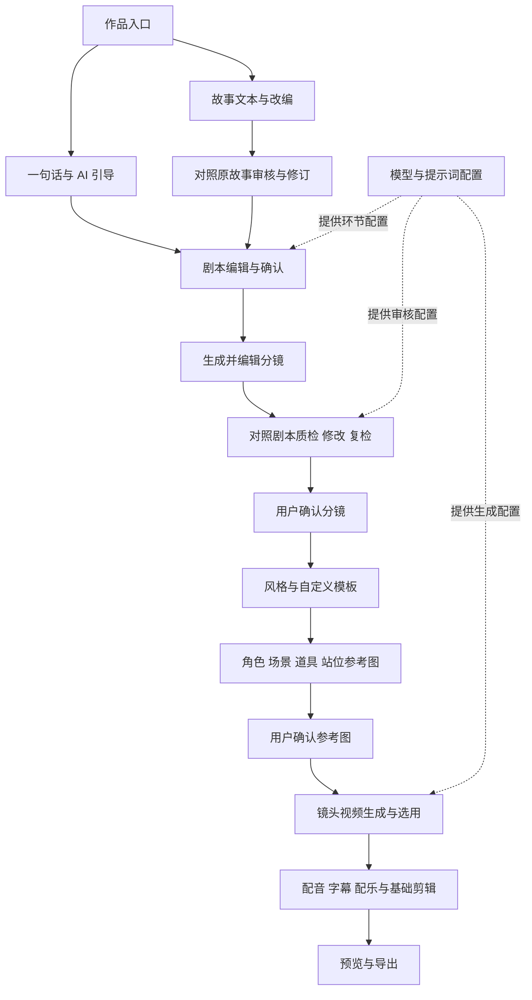

# 页面与流程

当前 MVP 仅两入口，页面规划以执行计划 v1.2 为准。保留作品与配置入口支持主线，不设置参考视频、账号或权限页面。

候选页面：projects / project-overview；system-settings / prompt-center；idea / story / script；storyboard / review；style / style-template / assets / asset-detail；video / clip-detail；finishing / export。状态展示页和跨模块真实关系在各模块交付时登记。

异常主线：未保存/离线 → 保留输入并重试；配置缺失/变量错误 → 就地修复；质检失败或内容变更 → 重新检查当前版本；部分生成失败 → 保留成功镜头并局部重试；素材过期/音画失配 → 定位调整并重新预览；导出失败 → 保留编辑结果并重试。

全局切换浅/深主题，跨页和刷新保持选择；不丢输入、不影响任务、不改媒体原色。字号、固定视口及配色在 G3 基线确认；所有步骤复用同一页框和必要配置入口。
