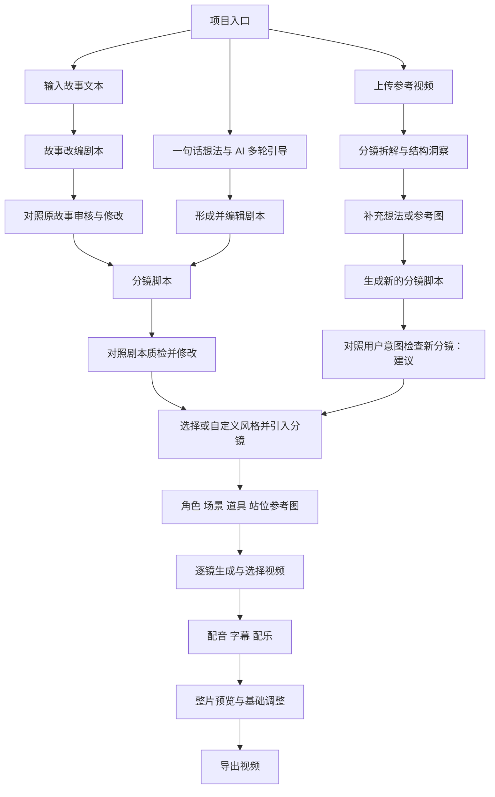

# 页面与流程草案

> 最新范围（2026-09-07）：MVP 仅一句话/故事两主线。参考视频再创作及账号/角色/用户权限等非主线模块暂缓；模型与提示词配置、质检、参考图、视频和成片制作保留。下文是早期推导历史；当前有效范围/页面计划请查看正式 PRD 01–03 与计划 v1.2。

> 状态更新：G0 v0.4 已于 2026-09-07 通过。下文保留研究推导；已确认范围及规则以定型摘要中的 G0 确认快照为准，后续交付顺序以 G1 板块计划为准。

> G0 研究草图；页面 ID 为候选，G1 再确认模块归属和原型清单。

## 三条主路径

路径二沿用路径一的分镜质检；路径三不强制虚构一份原剧本作比较对象，建议按用户想法、参考图和选定借鉴点检查新分镜。剧情忠实度与学习结构是不同审核目标。

## 候选页面

| 页面 ID | 职责 | 关键信息与操作 | 去向 |
| --- | --- | --- | --- |
| system-settings | 配置模型及环节分配 | 连接、模型能力、凭据、参数、检测、分配 | 各环节/项目入口 |
| prompt-center | 统一管理提示词 | 环节分类、默认版本、变量、预览、试运行、恢复默认 | 各环节就地编辑入口 |
| projects | 管理作品、选入口 | 项目状态、创建、继续编辑 | idea/story/remix |
| idea | 引导创意 | 对话、主题、受众、时长和画幅约束候选 | script |
| story | 输入故事 | 原文、改编要求、生成进度 | script |
| remix | 分析参考视频并再创作 | 上传、时间码分镜、洞察、想法与参考图 | storyboard |
| script | 编辑与审核剧本 | 原文对照、剧本版本、问题清单 | storyboard |
| storyboard | 编辑分镜及质检 | 镜头列表、动作情绪、来源对应、采纳修改 | style |
| style | 选择视觉风格 | 预设、自定义模板、导入分镜版本 | assets |
| assets | 管理参考素材 | 角色/场景/道具/站位图、镜头绑定、选择或重生成 | video |
| video | 生成与选择镜头 | 镜头任务、候选片段、预览、重试 | export |
| export | 确认成片并导出 | 配音/字幕/配乐、顺序时长、缺失或过期素材、导出进度 | projects |

## 关键状态与恢复建议

- 文本与分镜：草稿 → 生成中 → 待审核 → 修改中 → 待确认 → 已确认；修改已确认内容后新版本回到待审核，不沿用旧审核结果。
- 视频上传：空 → 上传中 → 解析中 → 可分析；失败说明原因并允许重试或替换，原文件未解析完成时不展示虚构分镜。
- 生成任务：排队 → 运行 → 成功/部分失败/失败/取消；展示超时反馈，保留成功素材，重试限定到失败镜头。取消是否即时生效取决于后续供应商能力。
- 素材：候选 → 已选用 → 因上游修改待更新；用户能定位影响来源并保留历史版本。
- 导出：待检查 → 合成中 → 可下载/失败；镜头缺失需补齐，过期素材需确认，失败后保留编辑结果并允许重试。

## 跨阶段约束

分镜随时可编辑是用户明确要求。建议用户编辑时先保存，再显示所影响素材与重生成范围；禁止无提示全量重生成。多个任务同时运行时，结果归属发起时版本，不覆盖当前新版本。

## 已确认的优先交互

审核直接带入当前剧本或分镜及其对照依据，无需复制到外部聊天工具。拟采用“对照内容 + 问题清单 + 修改预览”的审核区；具体布局等待视觉规范与模块审核。默认项目创作参数为 30–90 秒竖屏，支持营销与剧情两类目标。

声音与基础剪辑需要补充状态：配音生成中/失败/待选用，字幕待校对/已确认，配乐未选/已选；镜头顺序或时长改变后提示检查音画及字幕同步，导出前可完整预览。镜头截短、延长及音频适配的具体规则在对应正式模块确定。

## 配置入口与状态建议

全局导航 → 系统配置 → 添加模型连接并检测 → 按调用环节分配 → 返回创作；全局导航 → 提示词中心 → 选择环节 → 编辑变量与指令 → 预览/试运行 → 保存默认版本。

各创作环节 → 提示词设置面板 → 查看继承来源 → 编辑当前项目覆盖 → 预览实际输入 → 保存 → 返回原环节运行。面板展示实际使用的模型，提供系统配置链接；单纯打开设置不丢失编辑内容、不自动发起生成。正式页面跳转与 manifest 在 G1/G4 按模块维护。

模型配置状态：未配置、待检测、检测中、可用、检测失败、能力不匹配；提示词状态：继承默认、项目自定义、未保存、变量缺失、试运行中、试运行失败、已保存。保存后新增任务使用新版本，排队/运行任务及已有结果保留提交时版本。

系统配置与提示词中心是跨流程能力，依赖于所有 AI 调用步骤；具体公共表单、状态、就地设置面板需回写 G3 参考与展示页。

## 全局主题与字号补充

用户要求新增浅/深主题切换按钮并保证字体醒目适中。各产品页面共用全局切换入口和字号规范，不新增独立主题页面。建议操作为“点击切换 → 立即应用 → 保存偏好”，跨页和刷新保持；切换不丢未保存内容、不影响进行中任务及原始媒体颜色。候选字号及双主题回归要求见 DESIGN；该规则随 G3 公共组件和 04 项目入口模块交付。
